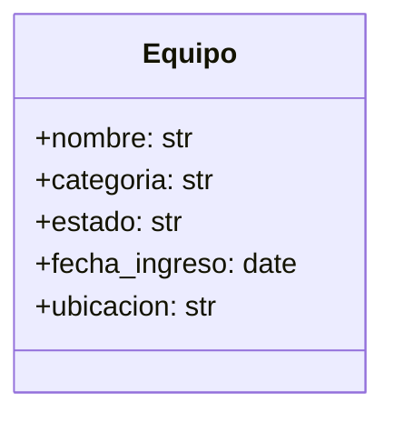

# Inventario Escolar

Sistema de gestión de inventario para equipos escolares desarrollado con Django.

## Propósito del Proyecto

Este proyecto tiene como objetivo principal proporcionar una solución robusta y fácil de usar para la administración del inventario de equipos tecnológicos dentro de una institución educativa. Permite registrar, categorizar, rastrear el estado y la ubicación de cada equipo, facilitando así una gestión eficiente de los recursos.

## Características Principales

*   Registro detallado de equipos (nombre, categoría, estado, fecha de ingreso, ubicación).
*   Interfaz de administración de Django para la gestión de datos.
*   Base de datos persistente (SQLite por defecto).

## Requisitos del Sistema

*   Python 3.8+
*   Django 5.2.7

## Instalación y Configuración

### 1. Clonar el Repositorio (si aplica)
```bash
# git clone <url_del_repositorio>
# cd inventario_escolar
```
*(Nota: Asumo que el proyecto ya está en el directorio actual, por lo que este paso puede ser omitido si el código ya está presente.)*

### 2. Crear y Activar un Entorno Virtual
Se recomienda utilizar un entorno virtual para aislar las dependencias del proyecto.

```bash
# Crear el entorno virtual (si no existe)
python -m venv venv

# Activar el entorno virtual:
# En Windows:
venv\Scripts\activate
# En macOS/Linux:
# source venv/bin/activate
```

### 3. Instalar Dependencias
Instala todas las librerías necesarias utilizando pip.

```bash
pip install -r requirements.txt
```

### 4. Configurar la Base de Datos
Django utiliza SQLite por defecto, por lo que no se requiere una configuración adicional de base de datos para empezar. Sin embargo, es necesario ejecutar las migraciones para crear las tablas necesarias.

```bash
python manage.py makemigrations
python manage.py migrate
```

### 5. Crear un Superusuario (para acceder al admin)
Para acceder al panel de administración de Django, necesitas crear un superusuario.

```bash
python manage.py createsuperuser
```
Sigue las instrucciones para ingresar el nombre de usuario, correo electrónico (opcional) y contraseña.

## Ejecución del Proyecto

### 1. Iniciar el Servidor de Desarrollo
Ejecuta el siguiente comando para iniciar el servidor de desarrollo de Django.

```bash
python manage.py runserver
```

### 2. Acceder a la Aplicación
Una vez que el servidor esté en ejecución, podrás acceder a la aplicación web en tu navegador en la siguiente dirección:

*   **Panel de Administración**: `http://127.0.0.1:8000/admin/`

## Diagrama de la Estructura del Modelo



## Documentación del Código

El código fuente ha sido documentado con comentarios explicativos en archivos relevantes como `models.py`, `admin.py` y `settings.py` para facilitar la comprensión y el mantenimiento del proyecto.
