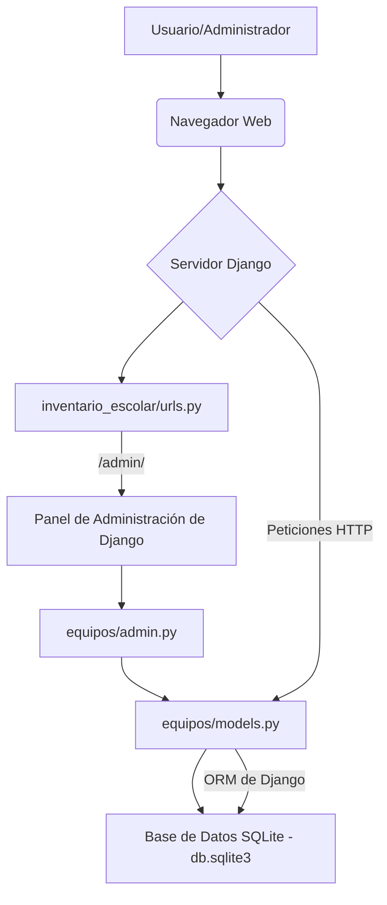

# Proyecto: Inventario Escolar

Este proyecto es una aplicación web desarrollada con el framework Django, diseñada específicamente para abordar la necesidad del Colegio Andes del Sur de gestionar de manera eficiente su inventario de equipos tecnológicos. La problemática central que resuelve esta aplicación es la dificultad en el control y la actualización de datos, ya que el colegio actualmente maneja esta información en planillas manuales.

Como solución, esta aplicación web utiliza Django para permitir el registro, consulta y administración de los equipos tecnológicos utilizados en las salas y laboratorios del colegio. Se ha configurado correctamente la conexión a la base de datos y se utiliza el panel de administración de Django (Django Admin) para facilitar la gestión de estos equipos.

## Repositorio del Proyecto

Puedes encontrar el código fuente de este proyecto en GitHub:
[https://github.com/ColDev-Colivoro/inventario_escolar.git](https://github.com/ColDev-Colivoro/inventario_escolar.git)

## Configuración del Entorno

### Requisitos
Asegúrate de tener Python 3.x y `pip` instalados en tu sistema.

### Instalación
1. Clona el repositorio:
   ```bash
   git clone https://github.com/ColDev-Colivoro/inventario_escolar.git
   cd inventario_escolar # Asegúrate de estar en el directorio raíz del proyecto Django
   ```
2. Crea un entorno virtual (opcional, pero recomendado):
   ```bash
   python -m venv venv
   source venv/bin/activate  # En Linux/macOS
   venv\Scripts\activate     # En Windows
   ```
3. Instala las dependencias:
   ```bash
   pip install -r requirements.txt
   ```

## Base de Datos

El proyecto utiliza SQLite como base de datos por defecto, configurada en `inventario_escolar/inventario_escolar/settings.py`. Esta configuración es ideal para desarrollo y pruebas.

```python
DATABASES = {
    "default": {
        "ENGINE": "django.db.backends.sqlite3", # Motor de base de datos
        "NAME": BASE_DIR / "db.sqlite3",       # Ruta al archivo de la base de datos
    }
}
```

### Gestión de la Base de Datos (Migraciones)
Para inicializar la base de datos y crear las tablas definidas por los modelos de Django:
```bash
python manage.py makemigrations # Crea los archivos de migración para tus modelos
python manage.py migrate         # Aplica las migraciones a la base de datos
```

## Superusuario

Un superusuario ya ha sido creado para facilitar el acceso al panel de administración de Django.

- **Usuario:** `colivoro`
- **Contraseña:** `colivoro`

**¡Advertencia de Seguridad!** Es crucial cambiar estas credenciales por unas más robustas y seguras en cualquier entorno de producción, se ponen aqui solo para la evaluación.

## Estructura del Proyecto y Componentes Clave

El proyecto `inventario_escolar` se organiza en una aplicación principal (`inventario_escolar`) y una aplicación secundaria (`equipos`) que maneja la lógica de negocio del inventario.

### `inventario_escolar/inventario_escolar/settings.py`
Este archivo centraliza la configuración global del proyecto Django.

**Modificaciones y Configuraciones Clave:**
- **`INSTALLED_APPS`**: Se ha registrado la aplicación `equipos` para que Django la reconozca y gestione sus modelos y funcionalidades.
  ```python
  INSTALLED_APPS = [
      # ... otras apps de Django
      "equipos", # Aplicación para la gestión de equipos
  ]
  ```
- **`DATABASES`**: Configuración por defecto para SQLite, apuntando a `db.sqlite3` en el directorio raíz del proyecto.
- **`LANGUAGE_CODE`**: Establecido en "en-us" por defecto. Para una interfaz en español, se puede cambiar a "es-es".
- **`TIME_ZONE`**: Establecido en "UTC".

### `inventario_escolar/inventario_escolar/urls.py`
Define el enrutamiento principal de URLs para todo el proyecto.

**Configuración Actual:**
Actualmente, solo se ha configurado la ruta para el panel de administración de Django. Cualquier otra funcionalidad (como vistas personalizadas para el inventario) requeriría añadir más rutas aquí o incluir las URLs de la aplicación `equipos`.

```python
from django.contrib import admin
from django.urls import path

urlpatterns = [
    path("admin/", admin.site.urls), # Ruta al panel de administración de Django
]
```

### `inventario_escolar/equipos/models.py`
Este archivo define la estructura de los datos que se almacenarán en la base de datos para la gestión de equipos.

**Modelo `Equipo`:**
Representa un equipo tecnológico individual en el inventario.
- `nombre` (CharField): Identificador principal del equipo.
- `categoria` (CharField): Tipo de equipo (ej. "Portátil", "Proyector", "Impresora").
- `estado` (CharField): Condición actual del equipo (ej. "Operativo", "En reparación", "Dado de baja").
- `fecha_ingreso` (DateField): Fecha en que el equipo fue registrado en el inventario.
- `ubicacion` (CharField): Lugar físico donde se encuentra el equipo (ej. "Sala de Cómputo", "Oficina de Dirección").

```python
from django.db import models

class Equipo(models.Model):
    nombre = models.CharField(max_length=100, verbose_name="Nombre del equipo")
    categoria = models.CharField(max_length=100, verbose_name="Categoría")
    estado = models.CharField(max_length=100, verbose_name="Estado actual")
    fecha_ingreso = models.DateField(verbose_name="Fecha de ingreso")
    ubicacion = models.CharField(max_length=100, verbose_name="Ubicación")

    def __str__(self):
        return self.nombre # Representación legible del objeto Equipo
```

### `inventario_escolar/equipos/admin.py`
Este archivo personaliza cómo el modelo `Equipo` se presenta y gestiona dentro del panel de administración de Django.

**Clase `EquipoAdmin`:**
- `@admin.register(Equipo)`: Registra el modelo `Equipo` con esta configuración personalizada.
- `list_display`: Define las columnas que se mostrarán en la tabla de equipos en el admin.
- `list_filter`: Permite filtrar la lista de equipos por `categoria`, `estado` y `ubicacion`.
- `search_fields`: Habilita una barra de búsqueda para encontrar equipos por `nombre`, `categoria` o `ubicacion`.

```python
from django.contrib import admin
from .models import Equipo

@admin.register(Equipo)
class EquipoAdmin(admin.ModelAdmin):
    list_display = ('nombre', 'categoria', 'estado', 'fecha_ingreso', 'ubicacion')
    list_filter = ('categoria', 'estado', 'ubicacion')
    search_fields = ('nombre', 'categoria', 'ubicacion')
```

## Ejecución del Proyecto

1. Asegúrate de haber aplicado las migraciones.
2. Inicia el servidor de desarrollo:
   ```bash
   python manage.py runserver
   ```
3. Accede al panel de administración en `http://127.0.0.1:8000/admin/` usando las credenciales del superusuario (`colivoro`/`colivoro`).

## Diagrama de Componentes (Conceptual)


Este diagrama ilustra el flujo principal de interacción con la aplicación, especialmente a través del panel de administración, y cómo los componentes de Django se relacionan con la base de datos.

## Cómo Deshacer/Revertir Cambios (Solo en Desarrollo)

Si necesitas revertir los cambios o reiniciar la base de datos (solo en desarrollo):

1. **Eliminar la base de datos:**
   ```bash
   rm db.sqlite3 # En Linux/macOS
   del db.sqlite3 # En Windows
   ```
2. **Eliminar archivos de migración de la aplicación `equipos`:**
   ```bash
   rm inventario_escolar/equipos/migrations/00*.py # En Linux/macOS
   del inventario_escolar\equipos\migrations\00*.py # En Windows
   ```
   (Asegúrate de no eliminar el archivo `__init__.py` dentro de la carpeta `migrations`)
3. **Crear nuevas migraciones:**
   ```bash
   python manage.py makemigrations equipos
   ```
4. **Aplicar las nuevas migraciones:**
   ```bash
   python manage.py migrate
   ```
5. **Crear un nuevo superusuario:**
   ```bash
   python manage.py createsuperuser
   ```
   Sigue las instrucciones en la terminal para crear un nuevo superusuario.
